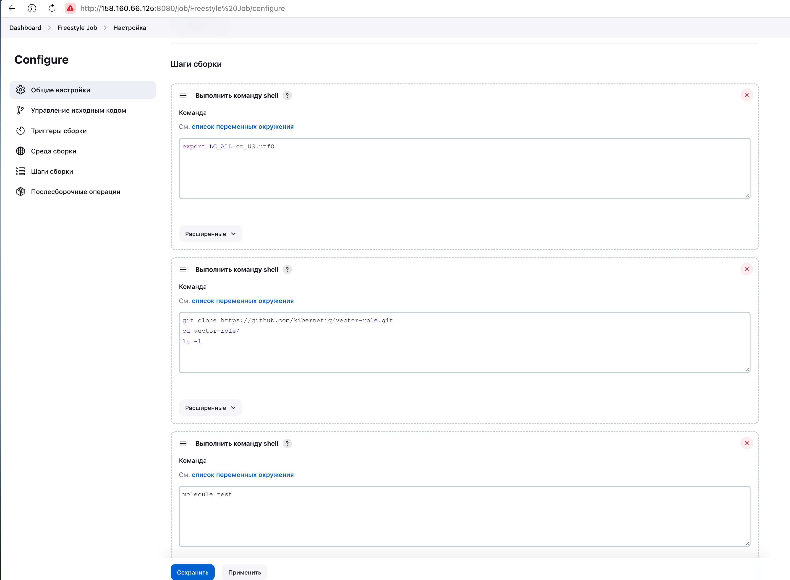

# Домашнее задание к занятию 10 «Jenkins»

## Подготовка к выполнению

1. Создать два VM: для jenkins-master и jenkins-agent.
<p align="center">
  
</p>

2. Установить Jenkins при помощи playbook.
<p align="center">
  
</p>

3. Запустить и проверить работоспособность.
<p align="center">
  
</p>

4. Сделать первоначальную настройку.
<p align="center">
  
</p>

## Основная часть

1. Сделать Freestyle Job, который будет запускать `molecule test` из любого вашего репозитория с ролью.
Для корректного запуска команды, добавил указание версий в site.yml 
<p align="center">
  
</p>
и добавил в джобе шаги
<p align="center">
  
</p>
<p align="center">
  
</p>

2. Сделать Declarative Pipeline Job, который будет запускать `molecule test` из любого вашего репозитория с ролью.
```
pipeline {
    agent {
        label 'ansible'
    }
    stages {
        stage('Clear work dir') {
            steps {
                deleteDir()
            }
        }
        stage('Clone git repo') {
            steps {
                dir('vector-role') {
                git branch: 'main', url: 'https://github.com/kibernetiq/vector-role.git'
                }
            }
        }
        stage('Molecule test') {
            steps {
                dir('vector-role') {
                sh 'molecule test'
                }
            }
        }
    }
}
```
<p align="center">
  
</p>
<p align="center">
  
</p>

3. Перенести Declarative Pipeline в репозиторий в файл `Jenkinsfile`.  
[Jenkinsfile](https://github.com/kibernetiq/netology_jenkins/blob/main/pipeline/Jenkinsfile)  
4. Создать Multibranch Pipeline на запуск `Jenkinsfile` из репозитория.

5. Создать Scripted Pipeline, наполнить его скриптом из [pipeline](./pipeline).
6. Внести необходимые изменения, чтобы Pipeline запускал `ansible-playbook` без флагов `--check --diff`, если не установлен параметр при запуске джобы (prod_run = True). По умолчанию параметр имеет значение False и запускает прогон с флагами `--check --diff`.
7. Проверить работоспособность, исправить ошибки, исправленный Pipeline вложить в репозиторий в файл `ScriptedJenkinsfile`.
8. Отправить ссылку на репозиторий с ролью и Declarative Pipeline и Scripted Pipeline.

## Необязательная часть

1. Создать скрипт на groovy, который будет собирать все Job, завершившиеся хотя бы раз неуспешно. Добавить скрипт в репозиторий с решением и названием `AllJobFailure.groovy`.
2. Создать Scripted Pipeline так, чтобы он мог сначала запустить через Yandex Cloud CLI необходимое количество инстансов, прописать их в инвентори плейбука и после этого запускать плейбук. Мы должны при нажатии кнопки получить готовую к использованию систему.

---

### Как оформить решение задания

Выполненное домашнее задание пришлите в виде ссылки на .md-файл в вашем репозитории.

---
