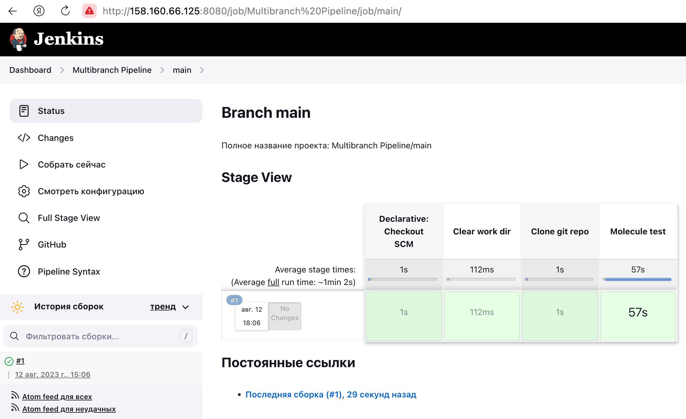

# Домашнее задание к занятию 10 «Jenkins»

## Подготовка к выполнению

1. Создать два VM: для jenkins-master и jenkins-agent.
<p align="center">
  
</p>

2. Установить Jenkins при помощи playbook.
<p align="center">
  
</p>

3. Запустить и проверить работоспособность.
<p align="center">
  
</p>

4. Сделать первоначальную настройку.
<p align="center">
  
</p>

## Основная часть

1. Сделать Freestyle Job, который будет запускать `molecule test` из любого вашего репозитория с ролью.
Для корректного запуска команды, добавил указание версий в site.yml 
<p align="center">
  
</p>
и добавил в джобе шаги
<p align="center">
  
</p>
<p align="center">
  
</p>

2. Сделать Declarative Pipeline Job, который будет запускать `molecule test` из любого вашего репозитория с ролью.
```
pipeline {
    agent {
        label 'ansible'
    }
    stages {
        stage('Clear work dir') {
            steps {
                deleteDir()
            }
        }
        stage('Clone git repo') {
            steps {
                dir('vector-role') {
                git branch: 'main', url: 'https://github.com/kibernetiq/vector-role.git'
                }
            }
        }
        stage('Molecule test') {
            steps {
                dir('vector-role') {
                sh 'molecule test'
                }
            }
        }
    }
}
```
<p align="center">
  
</p>
<p align="center">
  
</p>

3. Перенести Declarative Pipeline в репозиторий в файл `Jenkinsfile`.  
[Jenkinsfile](https://github.com/kibernetiq/netology_jenkins/blob/main/pipeline/Jenkinsfile)  
4. Создать Multibranch Pipeline на запуск `Jenkinsfile` из репозитория.
<p align="center">
  
</p>
<p align="center">
  
</p>

5. Создать Scripted Pipeline, наполнить его скриптом из [pipeline](./pipeline).
```
node("agent-01"){
    stage("Git checkout"){
        git url: 'https://github.com/aragastmatb/example-playbook.git'
    }
    stage("Sample define secret_check"){
        secret_check=true
    }
    stage("Run playbook"){
        if (secret_check){
            sh 'ansible-playbook site.yml -i inventory/prod.yml'
        }
        else{
            echo 'need more action'
        }
        
    }
}
```
<p align="center">
  
</p>

6. Внести необходимые изменения, чтобы Pipeline запускал `ansible-playbook` без флагов `--check --diff`, если не установлен параметр при запуске джобы (prod_run = True). По умолчанию параметр имеет значение False и запускает прогон с флагами `--check --diff`.
7. Проверить работоспособность, исправить ошибки, исправленный Pipeline вложить в репозиторий в файл `ScriptedJenkinsfile`.  
При выполнении Pipeline с вкл или выкл 'prod_run' отображатся ошибка

```
PLAY [Install Java] ************************************************************

TASK [Gathering Facts] *********************************************************
/usr/local/lib/python3.6/site-packages/ansible/parsing/vault/__init__.py:44: CryptographyDeprecationWarning: Python 3.6 is no longer supported by the Python core team. Therefore, support for it is deprecated in cryptography. The next release of cryptography will remove support for Python 3.6.
  from cryptography.exceptions import InvalidSignature
ok: [localhost]

TASK [java : Upload .tar.gz file containing binaries from local storage] *******
skipping: [localhost]

TASK [java : Upload .tar.gz file conaining binaries from remote storage] *******
changed: [localhost]

TASK [java : Ensure installation dir exists] ***********************************
fatal: [localhost]: FAILED! => {"changed": false, "module_stderr": "sudo: a password is required\n", "module_stdout": "", "msg": "MODULE FAILURE\nSee stdout/stderr for the exact error", "rc": 1}

PLAY RECAP *********************************************************************
localhost                  : ok=2    changed=1    unreachable=0    failed=1    skipped=1    rescued=0    ignored=0   

[Pipeline] }
[Pipeline] // stage
[Pipeline] }
[Pipeline] // node
[Pipeline] End of Pipeline
ERROR: script returned exit code 2
Finished: FAILURE
```
При ручном запуске плейбука на агенте, работает без ошибок.  
```
[yura@jenkins-agent example-playbook]$ ansible-playbook site.yml -i inventory/prod.yml
/usr/local/lib/python3.6/site-packages/ansible/parsing/vault/__init__.py:44: CryptographyDeprecationWarning: Python 3.6 is no longer supported by the Python core team. Therefore, support for it is deprecated in cryptography. The next release of cryptography will remove support for Python 3.6.
  from cryptography.exceptions import InvalidSignature

PLAY [Install Java] *************************************************************************************************************************************************

TASK [Gathering Facts] **********************************************************************************************************************************************
ok: [localhost]

TASK [java : Upload .tar.gz file containing binaries from local storage] ********************************************************************************************
skipping: [localhost]

TASK [java : Upload .tar.gz file conaining binaries from remote storage] ********************************************************************************************
ok: [localhost]

TASK [java : Ensure installation dir exists] ************************************************************************************************************************
changed: [localhost]

TASK [java : Extract java in the installation directory] ************************************************************************************************************
changed: [localhost]

TASK [java : Export environment variables] **************************************************************************************************************************
changed: [localhost]

PLAY RECAP **********************************************************************************************************************************************************
localhost                  : ok=5    changed=3    unreachable=0    failed=0    skipped=1    rescued=0    ignored=0
```

```
[yura@jenkins-agent example-playbook]$ ansible-playbook site.yml -i inventory/prod.yml --check --diff
/usr/local/lib/python3.6/site-packages/ansible/parsing/vault/__init__.py:44: CryptographyDeprecationWarning: Python 3.6 is no longer supported by the Python core team. Therefore, support for it is deprecated in cryptography. The next release of cryptography will remove support for Python 3.6.
  from cryptography.exceptions import InvalidSignature

PLAY [Install Java] *************************************************************************************************************************************************

TASK [Gathering Facts] **********************************************************************************************************************************************
ok: [localhost]

TASK [java : Upload .tar.gz file containing binaries from local storage] ********************************************************************************************
skipping: [localhost]

TASK [java : Upload .tar.gz file conaining binaries from remote storage] ********************************************************************************************
ok: [localhost]

TASK [java : Ensure installation dir exists] ************************************************************************************************************************
ok: [localhost]

TASK [java : Extract java in the installation directory] ************************************************************************************************************
skipping: [localhost]

TASK [java : Export environment variables] **************************************************************************************************************************
ok: [localhost]

PLAY RECAP **********************************************************************************************************************************************************
localhost                  : ok=4    changed=0    unreachable=0    failed=0    skipped=2    rescued=0    ignored=0
```
[ScriptedJenkinsfile](https://github.com/kibernetiq/netology_jenkins/blob/main/ScriptedJenkinsfile)

8. Отправить ссылку на репозиторий с ролью и Declarative Pipeline и Scripted Pipeline.
[]()